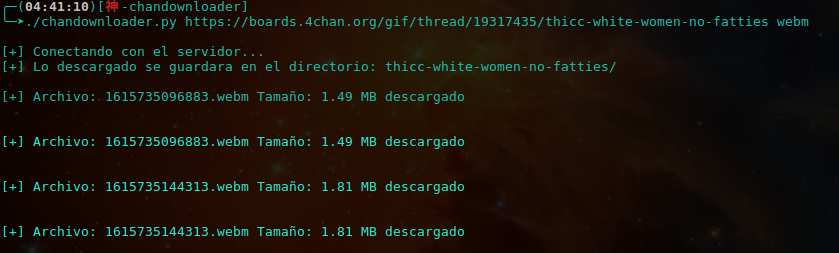

# 4chandownloader
Descarga de ficheros de 4Chan, ficheros como ser imagenes, video y de cualquier formato
Todo lo descargado se ira dentro del directorio generado automaticamente con el nombre del
Hilo.

## Instalacion de modulos
```pip install -r requirements.txt```

## Uso de 4Chandownloader

```./chandownloader.py <url del hilo> <formato>```

## Preview


